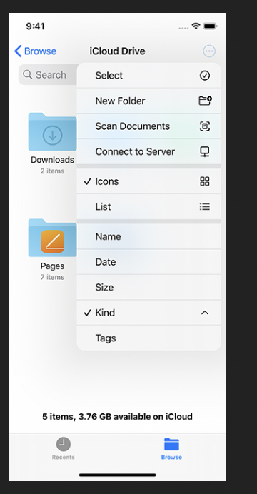

#  iOS Design Guideline Notes
Notes from the Code with Chris Design course module 4:
 https://learn.codewithchris.com/courses/take/design/lessons/25829963-lesson-2-app-architecture
There are seven major experiences that shape an app's architecture:
1. Launching
    - Or splash screens
    - First interaction with the user
    - Often bold color with the app name/ logo in the middle
    - Takes one-second of loading 
    - Avoid asking user for information, or showing disclaimers
        - Disclaimers should already appear in the app store
1. Onboarding
    - Fast, fun, educational
1. Loading
    - People should always know, when something is loading
        - Whether screen, element, or item
    - Skeleton screens:
        - These mock how the newly loaded screen will appear
        - These seem to take much shorter time for the user
    - Animate logo to keep users engaged for a short period
1. Modality
    - Temporary screen, or notification card that appears on current screen
    - Focus users attention on specific actions
    - Only use, if truly needed, because it removes user from the rest of the screen context
    - Always use a button to dismiss the modal view
1. Navigation
    - Provide clear path for users
    - Use standard navigation components e.g. tab bars, side bars
1. Accessing user data
    - Permissions screens requesting user data
1. Settings 
    - Separate screen for settings
    - Although, better if this already integrates with your app
    - Grabbing zip code etc.? Just ask for the user's location instead
        - Ask manually, if they deny access
    - Display more settings within the app, versus in the iPhone settings app
        - The iPhone settings app forces users to leave your app

# Interface Essentials
There are six interface essentials in iOS apps, as shown below.
From: https://learn.codewithchris.com/courses/take/design/lessons/25829970-lesson-4-interface-essentials-views
## Action Sheets
Action sheets prompt the user to make a choice at an important junction. For example, the deleting or saving
draft action sheet is one of the most well-known from the Mail app:

## Activity Views 
Contain copy, share, send a message type, or share sheet types of views

## Alerts
Accesses camera, location, or other type of alert message to the user, which must be acknowledged:

From: https://developer.apple.com/documentation/usernotifications/asking_permission_to_use_notifications

## Popover 
Often used within iPad apps, these contain a title, pickers and other elements. The one activated below
by clicking on the add button in the top-right. Note that it also reveals the plus button activated this:

From: https://developer.apple.com/ios/human-interface-guidelines/ui-views/popovers/

## Tables
In iOS a single-column list composes a *plain table*. Oftentimes, more advanced tables like spreadsheets do
not look good on the small real-estate of a mobile phone. Always left-align text, because we read from
left to right (versus centering this information): 

From: https://developer.apple.com/documentation/uikit/views_and_controls/table_views

## WebViews
Displays web content in the app. Because these designs come out of the box in Xcode, we focus on 
the navigation elements at the bottom of it. 

# Interface Essentials - Controls
List of all of the design elements: https://developer.apple.com/design/human-interface-guidelines/components/all-components
## Buttons
Use action verbs to represent buttons. The information icon and regular text button on the most common.

## Page Controls
These are most commonly seen as dots in a centered horizontal bar on the bottom of the screen. For
example in the Weather app. If you have multiple pages, then you can also provide a hamburger icon, which
will allow the user to jump to a specific one versus swiping through all of the available choices. In 
addition, you should always use the system default color, and no more than two symbols to reperesent these
e.g. location and dot as shown below.
From: https://developer.apple.com/design/human-interface-guidelines/ios/controls/page-controls/

## Pickers
Traditionally the picker is a scrollable list of values, where you can choose a date, or set option.
However, now it can also support dates, times, weeks etc. 

New picker option:
https://developer.apple.com/documentation/businesschatapi/messages_sent/interactive_messages/time_picker

More traditional:
https://developer.apple.com/design/human-interface-guidelines/ios/controls/pickers/

## Pull Down Menu
Ideal for a short list of items, it pulls down the options upon a user's click:
https://developer.apple.com/design/human-interface-guidelines/ios/controls/pull-down-menus/

## Progress Indicator
Tells the user something is loading. The classic spinning wheel icon with a text display can do this, 
a loading bar meanwhile, tells users how much longer to wait, and a third option displays a mocked screen
of how the page will look:

## Segmented Views
Contain a maximum of three labels. These are used to change the current view such as between a satellite,
or map view. Should have no more than one word for each of these labels.  

https://developer.apple.com/design/human-interface-guidelines/components/selection-and-input/segmented-controls

 
## Steppers
Similar to a two-step control, but only increases or decreases value of a quantity. Best practice to include
a text field as well, where the person can input the number.
https://developer.apple.com/design/human-interface-guidelines/components/selection-and-input/steppers

## Toggle
These visual toggles represent the metaphor of the on/ off switch. True or false for different states.
These are simple minimal and functional choices for the user.

https://developer.apple.com/design/human-interface-guidelines/components/selection-and-input/toggles

## TextField
Takes small information from user e.g. name, email, phone number. You never use TextFields for paragraphs
of text. Use clear buttons with the TextField as well. 
